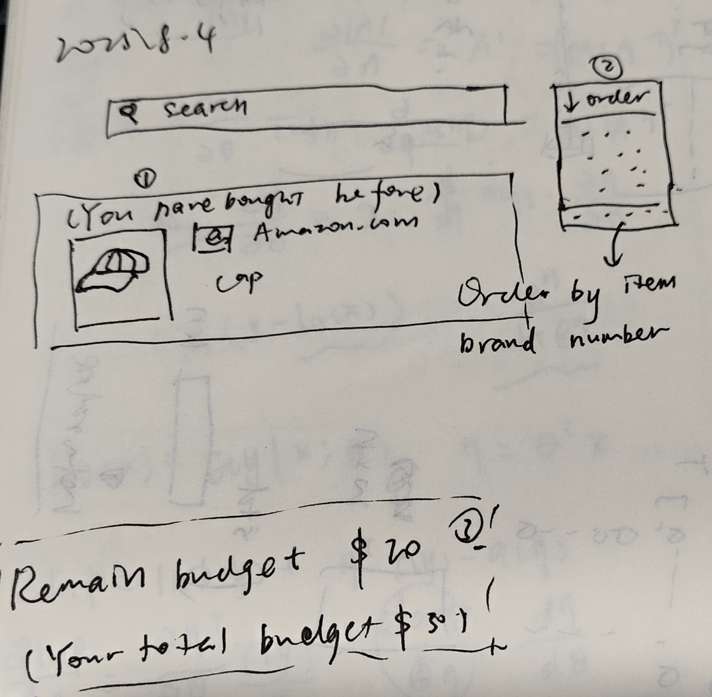

# **CS571 Spring 2025 – ICA A**

## Design Thinking

Please *make a copy* of this document by clicking **File \> Make a copy**. You may share and co-edit it with your fellow group members.  
---

In this in-class activity, you will explore the concept of **Design Thinking** by seeking to *make the college grocery shopping experience better*. You will do this by…

1. **Empathizing** with a user’s grocery shopping experience.  
2. **Defining** their wants and needs.  
3. **Ideating** some crazy, wild ideas.

Areas needing your response are clearly marked with **Your Turn\!** Be sure to complete all aspects of the assignment. Your Canvas submission will be a **pdf** version of this document.

You may complete this in groups of 1, 2, or 3 people\! :) Please be sure to assign yourself and your team member(s) to a group.

## **1\. Empathizing**

In class, you observe as a researcher follows and inquires with a college student as they go about their grocery shopping. This is a technique for **empathizing** with users. With your goal of this research being to *make the college grocery shopping experience better* (in some regard), make several notes during this video.

**Your Turn\!** Write your notes below. These can be direct quotes, general observations, notes about the environment, or anything else of interest and valuable to your research. You can add additional bullet points if need-be.

* Jack, food. 
* Check the refrigerator.
* Safeway > Trader Joe. More stuff. 
* Not online? Don't mind the walk. Hard to remind everthing you want to buy when shopping online. 
* Lots of brands. I've got it before. I trust it. 
* Don't mind paying for something I trust.  
* Spoil it before you can use it (?) 
* Quick bites. Do the self checkout.
* \$30 < \$50 is what you spend on groceries.

## 

## **2\. Defining**

Next, to better **define** the problem, you will use *affinity diagramming* to organize your notes and identify common themes. Specifically, you will identify themes in a *bottom-up fashion*. That is, you will begin with each of your observations on a sticky note but have *no common themes*. 

As a team, decide which notes are naturally similar to each other. Move the notes that are similar to each other closer together. Quickly, you will begin to identify clusters of notes. When your team agrees that the groups of notes are sufficient, identify a common theme for each of these groups.

To do this, I recommend creating [a Google Drawing](https://docs.google.com/drawings) and representing each sticky note with a square. When you have identified your groups, you may choose to give each theme a color and provide a label over those sticky notes

## **Your Turn\!** Paste *an image* of your affinity diagram below. Additionally, list out the common themes as bullet points below.

* More items to choose. 
* Loyal to the brand.
* Budget.  
* Quick and less time.

Paste your affinity diagram here.

## **3\. Ideating**

Then, **ideate** what a solution could look like. Follow [IDEO’s rules of engagement](https://www.ideou.com/blogs/inspiration/7-simple-rules-of-brainstorming) to encourage crazy, wild ideas. In one sentence, briefly describe an idea that could *make the college grocery shopping experience better*. Think large\! Your ideas do not need to strictly be related to software technology.

## **Your Turn\!** Describe each of your ideas in one sentence.

* When the shooper search for the same item that she had bought before, present what brand she had bought before.   
* List the remain budget everytime she add an item. 
* User can order by selecting the shop that has more brands.

Finally, choose **3** of your top ideas from above and *sketch* what each of these solutions would look like. You may choose to either hand draw these 3 sketches or to use whichever digital platform you prefer. *Reminder: You don’t need to be an artist\!* A sketch’s purpose is to *quickly communicate an idea*, not to be put on display at the Chazen\!

## **Your Turn\!** Paste your 3 sketches here.

After **ideating**, we would typically begin to **prototype**, **test**, and **implement**. We’ll stop here for the in-class activity; in future lectures we will explore these concepts more deeply\! Please be sure to submit this as a PDF to Canvas.  
