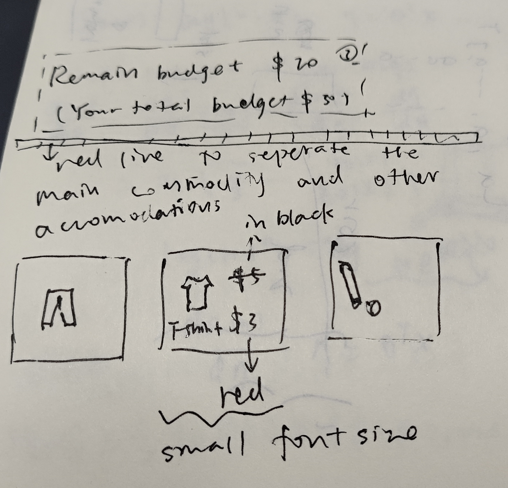

# **CS571 Spring 2025 – ICA B**

## Visual Design

Please *make a copy* of this document by clicking **File \> Make a copy**. You may share and co-edit it with your fellow group members.  
---

In this in-class activity, you will explore the concept of **Visual Design** in three steps: 

1. Analyzing for Elements and Principles  
2. Analyzing for Color, Type, and Image  
3. Practicing Visual Design

Areas needing your response are clearly marked with **Your Turn\!** Be sure to complete all aspects of the assignment. Your Canvas submission will be a **pdf** version of this document.

You may complete this in groups of 1, 2, or 3 people\! :) Please be sure to assign yourself and your team member(s) to a group.

## **1\. Analyzing for Elements and Principles**

In class, you learn about the **elements** and **principles** of design. The *elements* of design comprise the basic building blocks, whereas the *principles* of design orchestrate these elements to achieve your design goals. This could be to advertise a new product, employ participants for a research study, or improve the online shopping experience, among many, many other things.

**Your Turn\!** Analyze an existing webpage or graphic poster considering the design elements and principles and answer the following questions. 
 

1. What elements can you observe in the design?

In the webpage madison.com provided in slides, we can see straight lines (line) and traingles (shape), which indicate that the news on this page are quite formal.    

2. What principles can you see in use?

The news titles in this page are mostly black, forming a contrast with the colorful advertisement. The dark blue title in the center of this page is emphasized.    

3. What problems do you see that can be addressed using design elements and principles?

There are many words in this page, so there may exist a problem that the main topic is not concentrated. And the element of color and the principle of emphasis solve that. 

## 

## **2\. Analyzing for Color, Type, and Image**

Now,  you learned three key components for UX design: **color**, **type**, and **image**. These components are able to enrich your design. For example, the right usage of *color* can evoke specific emotions and convey your message effectively; choosing the right *type* can significantly improve readability and establish a strong visual hierarchy; and strategic use of *images* can capture attention and communicate complex ideas quickly. 

## **Your Turn\!** Using the webpage or graphic poster you chose in Step 1, answer the following questions with reference to the use of *color*, *type*, and *image*…

1. What use of color, type, and image can you observe in the design?

The letters of state journal are all in capital letters. The letters of POLO are in white letter, which stress the brand name of ad. 

2. How are those components used in the overall design? What kind of nuances and emotions do they create?

These components shapes a contrast between advertisements and news. They create an emotion of seriuosness.
     
3. How could you improve the design using color, type, and image?

The font size of breaking news should be bigger. 

## **3\. Practicing Visual Design**

After this thorough analysis, you're now ready to design on your own (or with your group\!). You will apply what you've learned through practice and bring a design idea to life.

## Do you remember the last product that you purchased online? What was the experience like? Imagine you get a chance to sell that product – what would that page look like?

## **Your Turn\!** Considering the elements and principles of visual design, with a specific focus on the use of type, color, and imagery, design a product page for a product of your choice. This page can be hand drawn or digitally created. Attach your drawing on the next page. Be sure to *annotate* your creation to describe any ambiguities. Your sketch does not need to be pixel-perfect, but it should provide enough detail for you to comment on your usage of design elements and principles, color, type, and imagery.

## Then consider and answer the following questions (please consider these questions *before* and *while* designing – be *intentional* with your usage of these visual design characteristics\!)…

1. How do you use the design elements and principles to direct user attention appropriately?

I use the element of color and principle of contrast to let the user be aware of the discount.

2. In what ways do you use color, type, and imagery?

How to use color is answered in Q1. Types are distinguished between ads and main text. Imagery is just about the picture of commodity.

After inserting your design into this document, please be sure to upload this as a PDF to Canvas\!