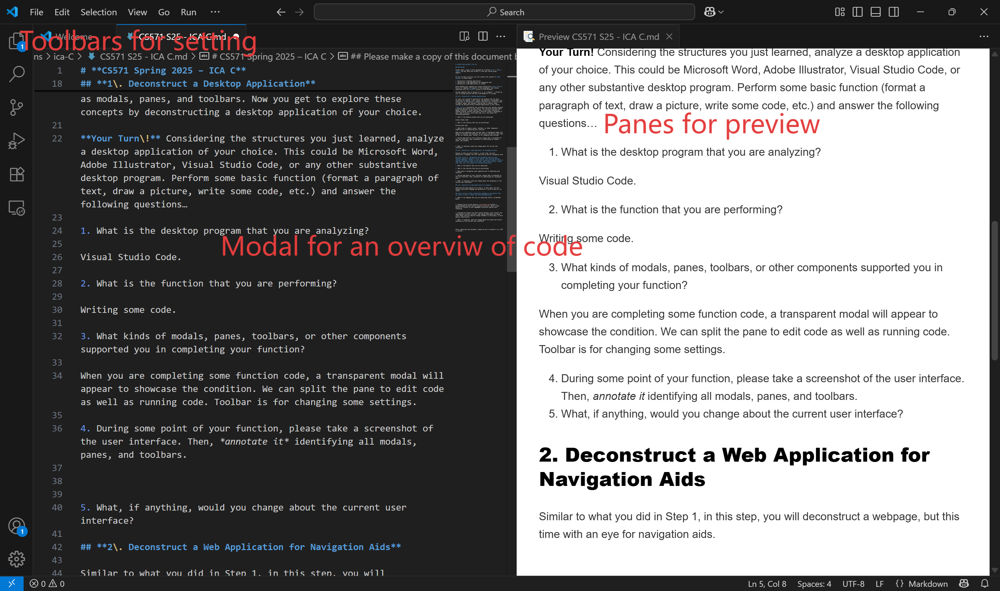

# **CS571 Spring 2025 – ICA C**

## Web Design

Please *make a copy* of this document by clicking **File \> Make a copy**. You may share and co-edit it with your fellow group members.  
---

In this in-class activity, you will explore the concept of **Web Design** in three steps: 

1. Deconstruct a Desktop Application  
2. Deconstruct a Web Application for Navigation Aids  
3. Deconstruct a Web Application for Layout

Areas needing your response are clearly marked with **Your Turn\!** Be sure to complete all aspects of the assignment. Your Canvas submission will be a **pdf** version of this document.

You may complete this in groups of 1, 2, or 3 people\! :) Please be sure to assign yourself and your team member(s) to a group.

## **1\. Deconstruct a Desktop Application**

In class, you learned to deconstruct the desktop into its basic structures of windows, icons, menus, and pointers. Furthermore, you learned how to deconstruct a desktop interface into structures such as modals, panes, and toolbars. Now you get to explore these concepts by deconstructing a desktop application of your choice.

**Your Turn\!** Considering the structures you just learned, analyze a desktop application of your choice. This could be Microsoft Word, Adobe Illustrator, Visual Studio Code, or any other substantive desktop program. Perform some basic function (format a paragraph of text, draw a picture, write some code, etc.) and answer the following questions…

1. What is the desktop program that you are analyzing?

Visual Studio Code. 

2. What is the function that you are performing?

Writing some code. 

3. What kinds of modals, panes, toolbars, or other components supported you in completing your function?

When you are completing some function code, a transparent modal will appear to showcase the condition. We can split the pane to edit code as well as running code. Toolbar is for changing some settings. 

4. During some point of your function, please take a screenshot of the user interface. Then, *annotate it* identifying all modals, panes, and toolbars.

5. What, if anything, would you change about the current user interface?

Nothing.

## **2\. Deconstruct a Web Application for Navigation Aids**

Similar to what you did in Step 1, in this step, you will deconstruct a webpage, but this time with an eye for navigation aids.

## **Your Turn\!**  Considering the navigation aids you just learned, analyze a website of your choice. This could be Amazon, Channel 3000 News, GitHub, or any other substantive website. Perform some basic function (shop for an item, read a news article, review some code, etc.) and answer the following questions…

1. What is the website that you are analyzing?

Github official homepage.

2. What is the function that you are performing?

Searching for a repository. 

3. What kind of navigation aids supported you in completing your function?

Sometimes I use the secondary navigation aid or searching function to search for a repository.

4. During some point of your function, please take a screenshot of the user interface. Then, *annotate it* identifying all navigation aids.

5. What, if anything, would you change about the navigation of the current user interface?

Combine the searching aid with AI to fully utilize it.

## **3\. Deconstruct a Web Application for Layout**

Analyzing the same website as in Step 2, in this step, you will choose a particular webpage and deconstruct it with an eye for its layout.

## **Your Turn\!** Using a particular webpage of the website that you chose in Step 2, answer the following questions…

1. What is the webpage that you are analyzing? Paste a screenshot below.  
     

2. Examine the 12 screen patterns [introduced here](http/s://designingwebinterfaces.com/our-patterns-in-print). Which screen pattern is closest to your webpage’s structure? Explain your reasoning.  

'Master/Detail' might be the closest structure. We can select the master rows to filter the results.

3. Considering content from both “Visual Design” (last lecture) and “Web Design” (current lecture), what design techniques are being used? These could be specific design elements or principles, or more general observations.

Different colors are used to represent different languages. The repository names that include the searching content are bolded. Blue repository names and white descriptions are distincted. Both search and navigation aids are used here. 

4. What, if anything, would you change about the layout and overall aesthetics of the current user interface?  

The space left for open source sponsor might be too big.    

After completing this document, please be sure to upload it as a PDF in Canvas\!